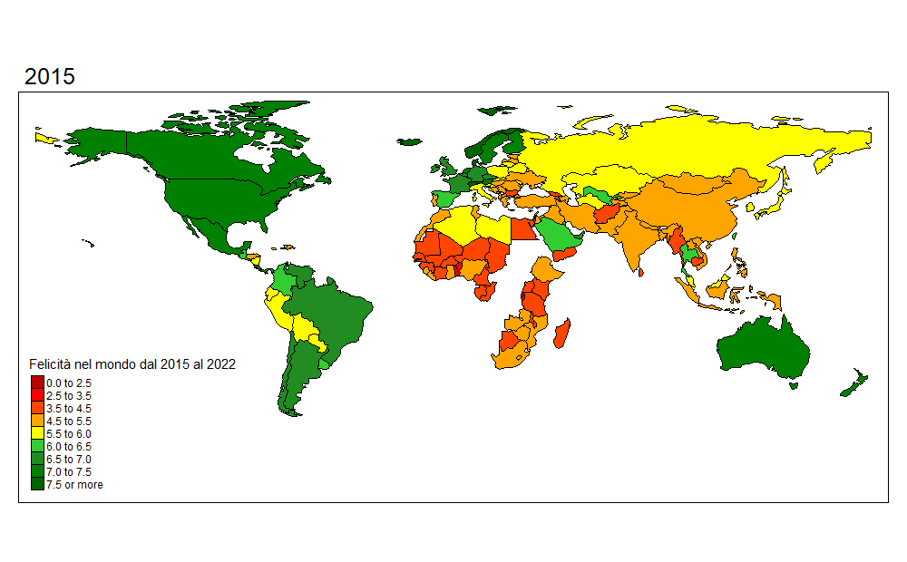

```{r setup, include=FALSE}
library(tidyverse)
library(lubridate)
library(readr)
library(DescTools)
library(hablar)
require(maps)
library(tmap)

knitr::opts_chunk$set(echo = TRUE)
```

## Introduzione
Il "World Happiness Report" è...

Si hanno a disposizione i dati dal 2015 al 2022 di 153 stati

Distopia... (1.85)

5 fattori per misurare la felicità di uno stato

## Importazione dei dati
```{r datasets}
df_2015 = read.csv("datasets/2015.csv")
df_2016 = read.csv("datasets/2016.csv")
df_2017 = read.csv("datasets/2017.csv")
df_2018 = read.csv("datasets/2018.csv")
df_2019 = read.csv("datasets/2019.csv")
df_2020 = read.csv("datasets/2020.csv")
df_2021 = read.csv("datasets/2021.csv")
df_2022 = read.csv("datasets/2022.csv")
```

## Normalizzazione dei dati
Il seguente codice serve per normalizzare i dati dei singoli dataframe per poi includerli in un unico dataset con cui lavorare.

```{r tidy}
#dfList <- list(df_2016, df_2017, df_2018, df_2019, df_2020, df_2021, df_2022)

df_2020 = df_2020[,-(4:13)]
df_2021 = df_2021[,-(4:13)]

tidyDf = function(df) {
  #aggiungo la colonna anno
  year = substr(substitute(df),4,7)
  df$Year = year
  
  #tolgo alcuni attributi che non mi interessano come l'errore standard e il residuo distopico
  drops = c("Standard", "Whisker", "Dystopia", "Lower", "Upper", "Rank")
  
  df = df %>% select(-contains(drops))
  
  #rinonimo la colonna "Country"
  colnames(df)[which(names(df) %like% "%ountry%")] <- "Country"
  
  #rinonimo la colonna "Score"
  colnames(df)[which(names(df) %like% "%core%")] <- "Score"
  
  #rinonimo la colonna "GDP per capita"
  colnames(df)[which(names(df) %like% "%GDP%")] <- "GDP per capita"
  
  #rinonimo la colonna "Social support"
  colnames(df)[which(names(df) %like% "%Family%")] <- "Social support"
  colnames(df)[which(names(df) %like% "%ocial%")] <- "Social support"
  
  #rinonimo la colonna "Generosity"
  colnames(df)[which(names(df) %like% "%enerosity%")] <- "Generosity"
  
  #rinonimo la colonna "Trust in goverment"
  colnames(df)[which(names(df) %like% "%orruption%")] <- "Trust in goverment"
  
  #rinonimo la colonna "Health"
  colnames(df)[which(names(df) %like% "%ealth%")] <- "Health"
  
  #rinonimo la colonna "Freedom"
  colnames(df)[which(names(df) %like% "%reedom%")] <- "Freedom"
  
  df = df %>% select(-contains("region")) %>% arrange(desc(Score))
  
  df = df %>% convert(num(Score:Year))
  

}

#applicare la funzione per ogni dataframe
df_2015 = tidyDf(df_2015)
#view(df_2015)
df_2016 = tidyDf(df_2016)
#view(df_2016)
df_2017 = tidyDf(df_2017)
#view(df_2017)
df_2018 = tidyDf(df_2018)
#view(df_2018)
df_2019 = tidyDf(df_2019)
#view(df_2019)
df_2020 = tidyDf(df_2020)
#view(df_2020)
df_2021 = tidyDf(df_2021)
#view(df_2021)
df_2022 = tidyDf(df_2022)
#view(df_2022)

#unione di tutti i dataframe
df_union = union(df_2015, df_2016)
df_union = union(df_union, df_2017)
df_union = union(df_union, df_2018)
df_union = union(df_union, df_2019)
df_union = union(df_union, df_2020)
df_union = union(df_union, df_2021)
df_union = union(df_union, df_2022)
df_union = df_union %>% arrange(desc(Score))
#view(df_union)

#view(df_union[rowSums(is.na(df_union))>0,])
#row 165 Trust = NA

#controllo gli stati che appaiono più volte con nomi diversi
#view(df_union %>% count(Country) %>% arrange(n) %>% filter(n < 8) %>% arrange(Country))

#sistemo i nomi
df_union = df_union %>% mutate(Country = case_when(
  Country == "Azerbaijan*" ~ "Azerbaijan",
  Country == "Belarus*" ~ "Belarus", 
  Country == "Botswana*" ~ "Botswana",
  Country == "Chad*" ~ "Chad",
  Country == "Comoros*" ~ "Comoros",
  Country == "Congo (Kinshasa)" ~ "Congo, Democratic Republic of the",
  Country == "Congo (Brazzaville)" ~ "Congo",
  Country == "Czechia" ~ "Czech Republic",
  Country == "Eswatini, Kingdom of*" ~ "Eswatini",
  Country == "Swaziland" ~ "Eswatini",
  Country == "Guatemala*" ~ "Guatemala",
  Country == "Gambia*" ~ "Gambia",
  Country == "Hong Kong S.A.R., China" ~ "Hong Kong",
  Country == "Hong Kong S.A.R. of China" ~ "Hong Kong",
  Country == "Kuwait*" ~ "Kuwait",
  Country == "Lesotho*" ~ "Lesotho",
  Country == "Liberia*" ~ "Liberia",
  Country == "Libya*" ~ "Libya",
  Country == "Luxembourg*" ~ "Luxembourg",
  Country == "Madagascar*" ~ "Madagascar",
  Country == "Mauritania*" ~ "Mauritania",
  Country == "Niger*" ~ "Niger",
  Country == "Palestinian Territories*" ~ "Palestinian Territories",
  Country == "Rwanda*" ~ "Rwanda",
  Country == "Turkmenistan*" ~ "Turkmenistan",
  Country == "Yemen*" ~ "Yemen",
  Country == "North Macedonia" ~ "Macedonia",
  Country == "Northern Cyprus" ~ "North Cyprus",
  Country == "North Cyprus*" ~ "North Cyprus",
  Country == "Somaliland region" ~ "Somaliland",
  Country == "Somaliland Region" ~ "Somaliland",
  Country == "Taiwan Province of China" ~ "Taiwan",
  Country == "Trinidad & Tobago" ~ "Trinidad and Tobago",
  TRUE ~ as.character(Country)
))

#togliere stati con meno di 7 anni di informazioni tranne Comoros a cui manca 2017 e 2018
less7 = df_union %>% count(Country) %>% filter(n<7) %>% filter(Country != "Comoros")
#print(df_union %>% count())
#1231
#print(sum(less7$n))
#71 righe da eliminare
df_less7 = filter(df_union, Country %in% less7$Country)
df_union = setdiff(df_union, df_less7)
#print(df_union %>% count())
#1160
df_union$iso_a3 = countrycode(sourcevar = prova$Country, origin = "country.name", destination = "iso3c")
df_union = df_union %>% filter(Country != "Kosovo")
#print(df_union %>% count())
#1152
view(df_union)
```

## La felicità nel mondo dal 2015 al 2022

``` {r analyze}
data("World")
World = World %>% select(iso_a3, continent)
World = left_join(df_union, World, by="iso_a3")

avg_by_year = World %>% group_by(Year, continent) %>% summarise(avg = mean(Score))
avg_by_year = avg_by_year %>% drop_na()
ggplot(avg_by_year, aes(Year, avg, colour = continent)) +
    geom_line(aes(group = continent), show.legend = TRUE) +
    theme_classic()
```
``` {r}
#data("World")
#World = World %>% select(iso_a3, continent)
#World = left_join(World, df_union, by="iso_a3")

```

``` {r echo=FALSE, message=FALSE, comment="", results='hide'}
data("World")
World = left_join(World, df_union, by="iso_a3")

score_ap <- 
  tm_shape(World) +
  tm_facets(along = "Year", free.coords = FALSE, showNA = FALSE) +
  tm_style("col_blind") +
  tm_fill("Score", title="Felicità nel mondo dal 2015 al 2022", style = "fixed",
        breaks = c(0, 2.5, 3.5, 4.5, 5.5, 6, 6.5, 7, 7.5, Inf),
        palette = c("#BA0000", "red", "#FF4500", "orange", "yellow", "#32CD32", "#228B22", "#008000", "#006400"),
        colorNA = "gray") +
  tm_borders()

#creazione gif
tmap_animation(world_anim, filename = "score_by_year.gif", delay = 200, width = 1000, height = 620)
```

Animazione punteggio della felicità per paese dal 2015 al 2022

```{r}

```

## Andamento della felicità fra il 2015 e il 2019


## Impatto nei primi mesi (2020) 


## Andamento negli anni successivi


## Conclusioni
C'è stato un cambiamento significativo nella felicità fra gli anni prima del covid e il 2020? E negli anni successivi?
