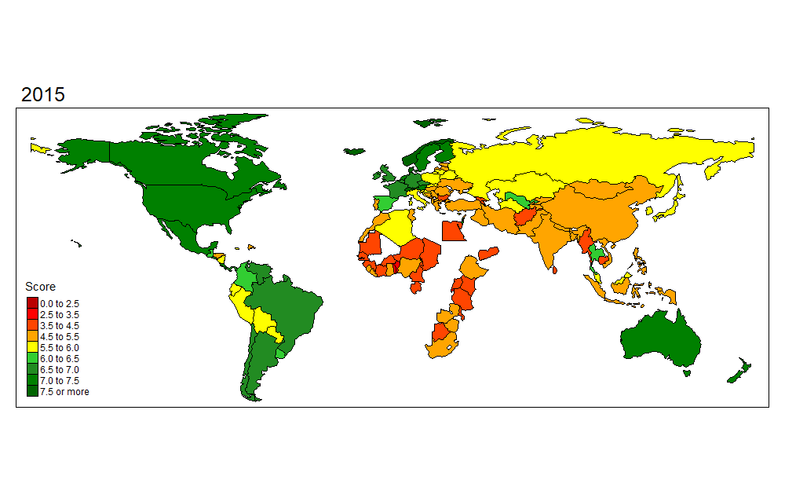

```{r setup, include=FALSE}
library(tidyverse)
library(lubridate)
library(readr)
library(DescTools)
library(countrycode)
library(hablar)
require(maps)
library(tmap)
library(gganimate)
library(corrplot)
library(plotly)
library(viridis)
library(tableHTML)

knitr::opts_chunk$set(echo = FALSE, comment=NA, message=FALSE, comment="", warning=FALSE)
```

## Introduzione
Lo scopo di questo studio è quello di analizzare se c'è stato un cambiamento nella felicità delle persone prima e dopo l'avvento del COVID-19 e la crisi che lo ha accompagnato.

Per far ciò sono stati analizzati i *World Happinness Report* dal 2015 al 2022.

**World Happiness Report**

Il *World Happiness Report* è una pubblicazione del Sustainable Development Solutions Network organizzato dal Gallup World Poll data che contiene articoli e classifiche della felicità nazionale dei vari stati del mondo, sulla base di interviste, e i fattori prevalenti che vengono analizzati sono:

- GDP per capita
- salute
- supporto sociale
- libertà
- fiducia nel governo
- generosità

percepiti dalle persone verso la propria comunità/nazione.

I report coinvolgono 153 stati e sono stati reperiti su Kaggle al seguente link [World Happiness Report up to 2022](https://www.kaggle.com/datasets/mathurinache/world-happiness-report?resource=download&select=2015.csv)

```{r datasets, echo=FALSE}
df_2015 = read.csv("datasets/2015.csv")
df_2016 = read.csv("datasets/2016.csv")
df_2017 = read.csv("datasets/2017.csv")
df_2018 = read.csv("datasets/2018.csv")
df_2019 = read.csv("datasets/2019.csv")
df_2020 = read.csv("datasets/2020.csv")
df_2021 = read.csv("datasets/2021.csv")
df_2022 = read.csv("datasets/2022.csv")
```

```{r tidy, echo=FALSE}
df_2020 = df_2020[,-(4:13)]
df_2021 = df_2021[,-(4:13)]

tidyDf = function(df) {
  #aggiungo la colonna anno
  year = substr(substitute(df),4,7)
  df$Year = year
  
  #tolgo alcuni attributi che non mi interessano come l'errore standard e il residuo distopico
  drops = c("Standard", "Whisker", "Dystopia", "Lower", "Upper", "Rank")
  
  df = df %>% select(-contains(drops))
  
  #rinonimo la colonna "Country"
  colnames(df)[which(names(df) %like% "%ountry%")] <- "Country"
  
  #rinonimo la colonna "Score"
  colnames(df)[which(names(df) %like% "%core%")] <- "Score"
  
  #rinonimo la colonna "GDP per capita"
  colnames(df)[which(names(df) %like% "%GDP%")] <- "GDP per capita"
  
  #rinonimo la colonna "Social support"
  colnames(df)[which(names(df) %like% "%Family%")] <- "Social support"
  colnames(df)[which(names(df) %like% "%ocial%")] <- "Social support"
  
  #rinonimo la colonna "Generosity"
  colnames(df)[which(names(df) %like% "%enerosity%")] <- "Generosity"
  
  #rinonimo la colonna "Trust in goverment"
  colnames(df)[which(names(df) %like% "%orruption%")] <- "Trust in goverment"
  
  #rinonimo la colonna "Health"
  colnames(df)[which(names(df) %like% "%ealth%")] <- "Health"
  
  #rinonimo la colonna "Freedom"
  colnames(df)[which(names(df) %like% "%reedom%")] <- "Freedom"
  
  df = df %>% select(-contains("region")) %>% arrange(desc(Score))
  
  df = df %>% convert(num(Score:Year))

}

#applicare la funzione per ogni dataframe
df_2015 = tidyDf(df_2015)
#view(df_2015)
df_2016 = tidyDf(df_2016)
#view(df_2016)
df_2017 = tidyDf(df_2017)
#view(df_2017)
df_2018 = tidyDf(df_2018)
#view(df_2018)
df_2019 = tidyDf(df_2019)
#view(df_2019)
df_2020 = tidyDf(df_2020)
#view(df_2020)
df_2021 = tidyDf(df_2021)
#view(df_2021)
df_2022 = tidyDf(df_2022)
#view(df_2022)

#unione di tutti i dataframe
df_union = union(df_2015, df_2016)
df_union = union(df_union, df_2017)
df_union = union(df_union, df_2018)
df_union = union(df_union, df_2019)
df_union = union(df_union, df_2020)
df_union = union(df_union, df_2021)
df_union = union(df_union, df_2022)
df_union = df_union %>% arrange(desc(Score))
#view(df_union)

#view(df_union[rowSums(is.na(df_union))>0,])
#row 165 Trust = NA

#controllo gli stati che appaiono più volte con nomi diversi
#view(df_union %>% count(Country) %>% arrange(n) %>% filter(n < 8) %>% arrange(Country))

#sistemo i nomi
df_union = df_union %>% mutate(Country = case_when(
  Country == "Azerbaijan*" ~ "Azerbaijan",
  Country == "Belarus*" ~ "Belarus", 
  Country == "Botswana*" ~ "Botswana",
  Country == "Chad*" ~ "Chad",
  Country == "Comoros*" ~ "Comoros",
  Country == "Congo (Kinshasa)" ~ "Congo, Democratic Republic of the",
  Country == "Congo (Brazzaville)" ~ "Congo",
  Country == "Czechia" ~ "Czech Republic",
  Country == "Eswatini, Kingdom of*" ~ "Eswatini",
  Country == "Swaziland" ~ "Eswatini",
  Country == "Guatemala*" ~ "Guatemala",
  Country == "Gambia*" ~ "Gambia",
  Country == "Hong Kong S.A.R., China" ~ "Hong Kong",
  Country == "Hong Kong S.A.R. of China" ~ "Hong Kong",
  Country == "Kuwait*" ~ "Kuwait",
  Country == "Lesotho*" ~ "Lesotho",
  Country == "Liberia*" ~ "Liberia",
  Country == "Libya*" ~ "Libya",
  Country == "Luxembourg*" ~ "Luxembourg",
  Country == "Madagascar*" ~ "Madagascar",
  Country == "Mauritania*" ~ "Mauritania",
  Country == "Niger*" ~ "Niger",
  Country == "Palestinian Territories*" ~ "Palestinian Territories",
  Country == "Rwanda*" ~ "Rwanda",
  Country == "Turkmenistan*" ~ "Turkmenistan",
  Country == "Yemen*" ~ "Yemen",
  Country == "North Macedonia" ~ "Macedonia",
  Country == "Northern Cyprus" ~ "North Cyprus",
  Country == "North Cyprus*" ~ "North Cyprus",
  Country == "Somaliland region" ~ "Somaliland",
  Country == "Somaliland Region" ~ "Somaliland",
  Country == "Taiwan Province of China" ~ "Taiwan",
  Country == "Trinidad & Tobago" ~ "Trinidad and Tobago",
  TRUE ~ as.character(Country)
))

#togliere stati con meno di 7 anni di informazioni tranne Comoros a cui manca 2017 e 2018
#less7 = df_union %>% count(Country) %>% filter(n<7) %>% filter(Country != "Comoros")
less7 = df_union %>% count(Country) %>% filter(n<8)
#print(df_union %>% count())
#1231
#print(sum(less7$n))
#71 righe da eliminare
df_less7 = filter(df_union, Country %in% less7$Country)
df_union = setdiff(df_union, df_less7)
#print(df_union %>% count())
#1160
df_union$iso_a3 = countrycode(sourcevar = df_union$Country, origin = "country.name", destination = "iso3c")
df_union = df_union %>% drop_na()
#print(df_union %>% count())
#1152
#view(df_union)
```
``` {r echo=FALSE, message=FALSE, comment="functions", results='hide'}
options(scipen = 999)

#funzione per calcolare il cambiamento della felicità per ogni paese in un range di anni
change_start_end = function(start, end) {
  df = df_union %>% filter(Year == start | Year == end)
  
  df = df %>%
    group_by(Country) %>%
    select(Year, Country, Score) %>%
    filter(Year == start | Year == end) %>%
    pivot_wider(names_from = Year, values_from = Score) %>% 
    rowwise()
  
    df[[paste("Change", end)]] <- df[[as.character(end)]] - df[[as.character(start)]]
    
    df = df[,-(2:3)]
    
    df
}
```

## La felicità prima del COVID-19

``` {r , echo=FALSE}
#i dati in realtà fanno riferimento all'anno precedente (ad esempio il report del 2022 ha i dati dei questionari del 2021) quindi prendiamo i dati fino al 2020 compreso
df_2015_2020 = df_union %>% filter(Year < 2021) %>% drop_na()

df_2015_2020 %>%
  group_by(Country) %>% 
  summarise(mean_score = mean(Score),
            mean_gdp_per_capita = mean(`GDP per capita`),
            mean_social_support = mean(`Social support`),
            mean_healthy_life_expectancy = mean(Health),
            mean_freedom_life_choices = mean(Freedom),
            mean_generosity = mean(Generosity),
            mean_corruption = mean(`Trust in goverment`),
            mean_total = sum(mean_gdp_per_capita, 
                        mean_social_support, 
                        mean_healthy_life_expectancy,
                        mean_freedom_life_choices,
                        mean_generosity,
                        mean_corruption),
            residual = mean_score - mean_total) %>% 
  arrange(-mean_score) %>% 
  slice_head(n = 20) %>% 
  pivot_longer(cols = c(mean_gdp_per_capita,
                        mean_social_support,
                        mean_healthy_life_expectancy,
                        mean_freedom_life_choices,
                        mean_generosity,
                        mean_corruption,
                        residual),
               names_to = "factor",
               values_to = "score"
  ) %>% 
  mutate(factor = case_when(factor == "mean_gdp_per_capita" ~ "GDP per capita",
                            factor == "mean_social_support" ~ "Supporto sociale",
                            factor == "mean_healthy_life_expectancy" ~ "Salute",
                            factor == "mean_freedom_life_choices" ~ "Libertà",
                            factor == "mean_generosity" ~ "Generosità",
                            factor == "mean_corruption" ~ "Fiducia nel governo",
                            factor == "residual" ~ "Altro",
                            TRUE ~ as.character(factor))) %>% 
  mutate(factor = as_factor(factor)) %>% 
  ggplot(aes(x = reorder(Country, mean_score),
             y = score,
             fill = factor)) +
  geom_col(position = position_stack(reverse = TRUE)) +
  coord_flip() +
  scale_fill_viridis_d(direction = -1, option = "turbo") +
  labs(title = "Top 20 stati per punteggio medio di felicità",
       x = "",
       y = "",
       fill = "") +
  theme(
    axis.text.y = element_text(face = "bold"),
    legend.position = "bottom",
    panel.grid.minor = element_blank(),
    panel.grid.major = element_blank()
    )
``` 

Gli stati più felici fanno parte del Nord Europa.

```{r echo=FALSE, message=FALSE, comment="", results='hide'}
df_2015_2020$iso_a3 = countrycode(sourcevar = df_2015_2020$Country, origin = "country.name", destination = "iso3c")
df_2015_2020 = df_2015_2020 %>% drop_na()

data("World")
World = left_join(World, df_2015_2020, by="iso_a3")
World = World %>% drop_na()

score_ap <- 
  tm_shape(World) +
  tm_facets(along = "Year", free.coords = FALSE, showNA = FALSE) +
  tm_style("col_blind") +
  tm_fill("Score", title="Score", style = "fixed",
        breaks = c(0, 2.5, 3.5, 4.5, 5.5, 6, 6.5, 7, 7.5, Inf),
        palette = c("#BA0000", "red", "#FF4500", "orange", "yellow", "#32CD32", "#228B22", "#008000", "#006400"),
        colorNA = "gray") +
  tm_borders()

#creazione gif
tmap_animation(score_ap, filename = "score_before.gif", delay = 200, width = 1000, height = 620)
```
```{r, echo=FALSE}

```
I continenti più felici sono Nord America, Nord Europa ed Oceania.

``` {r, echo=FALSE}
change_2015_2020 = change_start_end(2015,2020)

colnames(change_2015_2020)[2] = "Change"

a = df_union %>% 
      filter(Year == 2015 | Year == 2020) %>% 
      select(Year, Country, Score) %>%
      pivot_wider(names_from = Year, values_from = Score) %>% 
      rowwise()

change_2015_2020 = left_join(change_2015_2020, a, by = "Country")

change_2015_2020 = change_2015_2020[c("Country", "2015", "2020", "Change")]
``` 

**Incremento della felicità**
``` {r echo=FALSE, message=FALSE, comment=""}
data("World")
continents = World  %>% select(name,continent)
names(continents)[1] <- 'Country'

avg_continent_2015_2020 = left_join(df_2015_2020, continents, by = "Country")
avg_continent_2015_2020 = avg_continent_2015_2020[!duplicated(avg_continent_2015_2020),]
avg_continent_2015_2020 = avg_continent_2015_2020 %>% group_by(Year, continent) %>% summarise(Mean = mean(Score)) %>% drop_na()

avg_continent_2015_2020 %>% ggplot(aes(x=Year, y=Mean, group=continent, colour=continent )) +
                            geom_line(size=1.5) +
                            theme_classic()
```

Il Sud America risulta aver avuto una decrescita significativa rispetto agli altri continenti che sono o aumentati o rimasti pressochè costanti.


``` {r, echo=FALSE}
#non mi funziona la libreria gt e tableHTML non mi troncava a 20 righe
change_2015_2020 %>% select(1:4) %>% arrange(Change) %>% slice_head(n=20)
``` 
Nota: il Venezuela sta subendo una crisi dal 2013 e ne ebbe una presidenziale nel 2019.

``` {r, echo=FALSE}
mean_by_year_2015_2020 = df_2015_2020 %>% group_by(Year) %>% summarise(Media = mean(Score))

aumento_2015_2020 = trunc(((mean_by_year_2015_2020[6,2] - mean_by_year_2015_2020[1,2]) * 100) *10^2)/10^2

ggplot(mean_by_year_2015_2020, aes(x=Year, y=Media)) +
    geom_line(size=2, color = "red") +
    ggtitle(paste("Aumento media mondiale del", aumento_2015_2020, "%")) +
    theme_bw(base_size=15) +
    theme(panel.background = element_rect(fill = "lightyellow")) +
    ylab("Score medio") +
    xlab("Anno")
``` 

``` {r, include=FALSE}
change_2015_2020$iso_a3 = countrycode(sourcevar = change_2015_2020$Country, origin = "country.name", destination = "iso3c")
change_2015_2020 = change_2015_2020 %>% drop_na()

data("World")
World = left_join(World, change_2015_2020, by="iso_a3")
World = World %>% drop_na()

tm_shape(World) + 
  tm_polygons(col = "Change", n = 10, style ="cont", palette = "seq") +
  tm_layout(aes.palette = list(seq = "RdYlGn"))
```

**Matrice di correlazione**

``` {r, echo=FALSE}
cor_2015_2019 <- round(
  cor(df_2015_2020 %>% 
      drop_na() %>% 
      select(-c(Year, Country, iso_a3))
    ), 2)

col <- colorRampPalette(c("#BB4444", "#EE9988", "#FFFFFF", "#77AADD", "#4477AA"))

corrplot(cor_2015_2019,
         method = "shade",
         shade.col = NA,
         tl.col = "black",
         tl.srt = 45,
         col = col(200),
         addCoef.col = "black",
         cl.pos = "n",
         order = "AOE",
         type = "upper")
```

Prima del COVID-19 i 3 fattori che influenzavano maggiormente lo score della felicità erano:

- GDP per capita
- salute
- supporto sociale

## Andamento della felicità dopo il COVID-19

``` {r, echo=FALSE}
df_2021_2022 = df_union %>% filter(Year > 2020) %>% drop_na()

df_2021_2022 %>%
  group_by(Country) %>% 
  summarise(mean_score = mean(Score),
            mean_gdp_per_capita = mean(`GDP per capita`),
            mean_social_support = mean(`Social support`),
            mean_healthy_life_expectancy = mean(Health),
            mean_freedom_life_choices = mean(Freedom),
            mean_generosity = mean(Generosity),
            mean_corruption = mean(`Trust in goverment`),
            mean_total = sum(mean_gdp_per_capita, 
                        mean_social_support, 
                        mean_healthy_life_expectancy,
                        mean_freedom_life_choices,
                        mean_generosity,
                        mean_corruption),
            residual = mean_score - mean_total) %>% 
  arrange(-mean_score) %>% 
  slice_head(n = 20) %>% 
  pivot_longer(cols = c(mean_gdp_per_capita,
                        mean_social_support,
                        mean_healthy_life_expectancy,
                        mean_freedom_life_choices,
                        mean_generosity,
                        mean_corruption,
                        residual),
               names_to = "factor",
               values_to = "score"
  ) %>% 
  mutate(factor = case_when(factor == "mean_gdp_per_capita" ~ "GDP per capita",
                            factor == "mean_social_support" ~ "Supporto sociale",
                            factor == "mean_healthy_life_expectancy" ~ "Salute",
                            factor == "mean_freedom_life_choices" ~ "Libertà",
                            factor == "mean_generosity" ~ "Generosità",
                            factor == "mean_corruption" ~ "Fiducia nel governo",
                            factor == "residual" ~ "Altro",
                            TRUE ~ as.character(factor))) %>% 
  mutate(factor = as_factor(factor)) %>% 
  ggplot(aes(x = reorder(Country, mean_score),
             y = score,
             fill = factor)) +
  geom_col(position = position_stack(reverse = TRUE)) +
  coord_flip() +
  scale_fill_viridis_d(direction = -1, option = "turbo") +
  labs(title = "Top 20 stati per punteggio medio di felicità",
       x = "",
       y = "",
       fill = "") +
  theme(
    axis.text.y = element_text(face = "bold"),
    legend.position = "bottom",
    panel.grid.minor = element_blank(),
    panel.grid.major = element_blank()
    )
``` 

``` {r,  echo=FALSE}
mean_2021_2022 = df_2021_2022 %>% group_by(Country) %>% summarise(Mean = mean(Score)) %>% drop_na()

mean_2021_2022$iso_a3 = countrycode(sourcevar = mean_2021_2022$Country, origin = "country.name", destination = "iso3c")
mean_2021_2022 = mean_2021_2022 %>% drop_na()

data("World")
World = left_join(World, mean_2021_2022, by="iso_a3")
World = World %>% drop_na()

tm_shape(World) + 
  tm_polygons(col = "Mean", n = 10, style ="cont", palette = "seq") +
  tm_layout(aes.palette = list(seq = "RdYlGn"))
``` 

Gli stati più felici risultano essere ancora quelli del Nord Europa.

``` {r, include=FALSE}
mean_2021_2022$Country = factor(mean_2021_2022$Country, 
                                  levels = mean_2021_2022$Country[
                                    order(mean_2021_2022$Mean, decreasing = TRUE)])

mean_2021_2022 %>% ggplot(aes(x=Country, y=Mean)) +
  geom_bar(stat = "identity") + 
  labs(y = "Punteggio medio",
       title = "Distribuzione della felicità (2021-2022)") +
  theme(axis.text.x=element_blank()) +
  geom_line(aes(x = as.numeric(Country), y = Mean), color = "red", size = 2.5)

#Non sono presenti particolari stacchi nello score della felicità fra paesi.
```

**Andamento della felicità media mondiale dopo il COVID-19**

``` {r, echo=FALSE}
change_2021_2022 = change_start_end(2021,2022)

colnames(change_2021_2022)[2] = "Change"

a = df_union %>% 
      filter(Year == 2021 | Year == 2022) %>% 
      select(Year, Country, Score) %>%
      pivot_wider(names_from = Year, values_from = Score) %>% 
      rowwise()

change_2021_2022 = left_join(change_2021_2022, a, by = "Country")

change_2021_2022 = change_2021_2022[c("Country", "2021", "2022", "Change")]
``` 

```{r, echo=FALSE}
avg_continent_2021_2022 = left_join(df_2021_2022, continents, by = "Country")
avg_continent_2021_2022 = avg_continent_2021_2022[!duplicated(avg_continent_2021_2022),]
avg_continent_2021_2022 = avg_continent_2021_2022 %>% group_by(Year, continent) %>% summarise(Mean = mean(Score)) %>% drop_na()

avg_continent_2021_2022 %>% ggplot(aes(x=Year, y=Mean, group=continent, colour=continent )) +
                            geom_line(size=1.5) +
                            labs(x="2021-2022",
                                 y="Media") +
                            theme(axis.text.x = element_blank())
```

Solo l'Europa risulta aver avuto un incremento mentre gli altri continenti hanno avuto tutti un lieve decremento.

```{r, echo=FALSE}
data("World")
World = World %>% select(iso_a3, continent)
World = left_join(df_union, World, by="iso_a3")

avg_by_year = df_union %>% group_by(Year) %>% summarise(Score = mean(Score))
a = df_union %>% group_by(Year) %>% summarise(GDP = mean(`GDP per capita`))
avg_by_year$GDP = a$GDP
a = df_union %>% group_by(Year) %>% summarise(Social = mean(`Social support`))
avg_by_year$SocialSupport = a$Social
a = df_union %>% group_by(Year) %>% summarise(Health = mean(Health))
avg_by_year$Health = a$Health
a = df_union %>% group_by(Year) %>% summarise(Freedom = mean(Freedom))
avg_by_year$Freedom = a$Freedom
a = df_union %>% group_by(Year) %>% summarise(Trust = mean(`Trust in goverment`))
avg_by_year$Trust = a$Trust
a = df_union %>% group_by(Year) %>% summarise(Generosity = mean(Generosity))
avg_by_year$Generosity = a$Generosity

for (x in c(2:8)) {
  avg_by_year[x,"Change"] = avg_by_year[x,"Score"] - avg_by_year[x-1,"Score"]
}
avg_by_year$Change = avg_by_year$Change * 100
avg_by_year$Change = trunc(avg_by_year$Change*10^2)/10^2
avg_by_year$Change = as.character(avg_by_year$Change)
avg_by_year$Change = paste(avg_by_year$Change, " %")
avg_by_year[1,"Change"] = ""
  
ggplot(avg_by_year, aes(x=Year, y=Score)) +
    geom_line(size=2, color = "red") +
    geom_text(aes(label=Change), fontface='bold' ,size=3.5, position = position_nudge(x=0, y=0.02)) +
    ggtitle("Andamento medio della felicità dal 2015 al 2022") +
    theme_bw(base_size=15) +
    theme(panel.background = element_rect(fill = "lightyellow")) +
    ylab("Punteggio") +
    xlab("Anno")
```

La felicità è diminuita del -1,33% nell'ultimo anno.

``` {r, comment="mappa cambiamento", include=FALSE}
change_2021_2022$iso_a3 = countrycode(sourcevar = change_2021_2022$Country, origin = "country.name", destination = "iso3c")
change_2021_2022 = change_2021_2022 %>% drop_na()

data("World")
World = left_join(World, change_2021_2022, by="iso_a3")
World = World %>% drop_na()

tm_shape(World) + 
  tm_polygons(col = "Change", n = 6, style ="fixed",
              breaks = c(-2, -0.25, -0.1, 0, 0.1, 0.25, Inf),
              palette = "RdYlGn",
              colorNA = "gray")
```
**Matrice di correlazione**

``` {r echo=FALSE}
cor_2021_2022 <- round(
  cor(df_2021_2022 %>% 
      drop_na() %>% 
      select(-c(Year, Country, iso_a3))
    ), 2)

col <- colorRampPalette(c("#BB4444", "#EE9988", "#FFFFFF", "#77AADD", "#4477AA"))

# Plot correlation matrix
corrplot(cor_2021_2022,
         method = "shade",
         shade.col = NA,
         tl.col = "black",
         tl.srt = 45,
         col = col(200),
         addCoef.col = "black",
         cl.pos = "n",
         order = "AOE",
         type = "upper")
```

Nel periodo dopo l'avvento del COVID-19 i 3 fattori che influenzano maggiormente lo score della felicità risultano essere:

- supporto sociale
- salute
- GDP per capita

## Conclusioni
- Prima dell'avento del COVID-19 la felicità media mondiale ha avuto un aumento del +13.1% mentre dopo una decrescita del -1.33%.
- Sono cambiati anche i fattori che influenzano il punteggio della felicità, prima era maggiormente influenzato dal GDP per capita mentre ora dal supporto sociale.